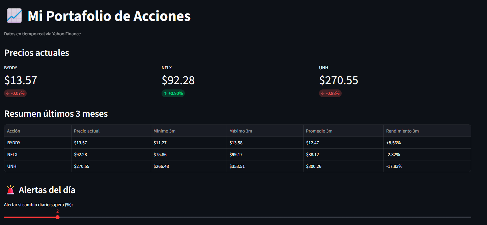

# 📈 Bot de Seguimiento de Acciones

Dashboard interactivo y bot de Telegram para monitorear mi portafolio de acciones en tiempo real.

## 🚀 ¿Qué hace este proyecto?

- Consulta precios en tiempo real de BYDDY, NFLX y UNH via Yahoo Finance
- Muestra historial de 3 meses con gráfica interactiva y media móvil de 20 días
- Tabla de resumen con métricas clave: mínimo, máximo, promedio y rendimiento
- Sistema de alertas configurables por porcentaje de cambio diario
- Bot de Telegram que envía resumen automático cada mañana de lunes a viernes

## 🛠️ Tecnologías utilizadas

- Python
- yfinance — datos financieros en tiempo real
- Streamlit — dashboard web interactivo
- Plotly — visualizaciones interactivas
- Telegram Bot API — notificaciones automáticas
- GitHub Actions — automatización en la nube

## ▶️ Cómo correr el proyecto localmente

1. Clona el repositorio
2. Crea un entorno virtual: `python -m venv venv`
3. Actívalo: `venv\Scripts\activate`
4. Instala dependencias: `pip install yfinance pandas plotly streamlit python-telegram-bot python-dotenv`
5. Crea tu archivo `.env` con tus credenciales:
```env
TELEGRAM_TOKEN=tu_token
TELEGRAM_CHAT_ID=tu_chat_id
```

6. Corre el dashboard: `streamlit run dashboard.py`

## 📊 Vista del dashboard




## 👤 Autor

Carlos Pinto — [LinkedIn](https://linkedin.com/in/carlozpinto) — [GitHub](https://github.com/carlozpinto)